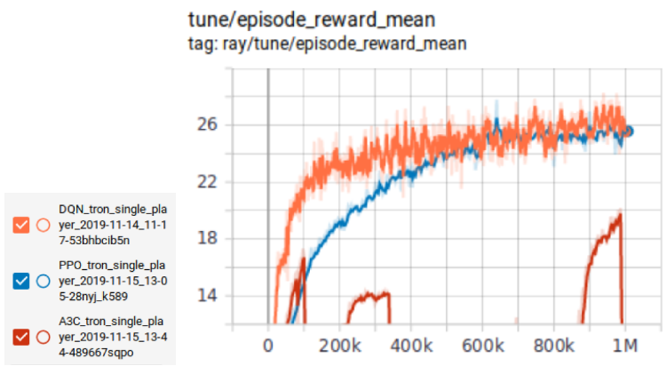

## **Project Summary**

**Tron Description**

For our project we created an AI to play the game Tron. Tron is a fully-observable multiagent free-for-all turn-based game. During the player's turn, the player has the option to go straight, left, or right. Each agent controls a motorcycle with a trail following it. The goal of the agent is to survive the longest by following three simple rules: Not crashing into the walls, not running into other agent’s trails, and not running into the agent’s own trail.

  

**Environment**

The environment is a 13x13 grid with 4 players (Our agent and 3 opponents). The grid is represented by a 2D array of integers where each player and their trail is represented by an integer and the empty spaces are zeros.

[[0, 0, 0, 0, 0, 0, 0, 0, 0, 0, 0, 0, 0],
[0, 0, 0, 0, 0, 0, 0, 0, 0, 0, **2**, 0, 0],
[0, 0, **1, 1, 1**, 0, 0, 0, 0, 0, **2**, 0, 0],
[0, 0, **1**, 0, 0, 0, 0, 0, 0, 0, **2**, 0, 0],
[0, 0, **1**, 0, 0, 0, 0, 0, 0, 0, **2**, 0, 0],
[0, 0, **1**, 0, 0, 0, 0, 0, 0, 0, **2**, 0, 0],
[0, 0, 0, 0, 0, 0, 0, 0, 0, 0, **2**, 0, 0],
[0, 0, 0, 0, 0, 0, 0, 0, 0, 0, 0, 0, 0],
[0, 0, 0, 0, 0, 0, 0, 0, 0, 0, 0, 0, 0],
[0, 0, 0, **4**, 0, 0, 0, 0, 0, 0, 0, 0, 0],
[0, 0, 0, **4**, 0, 0, 0, 0, **3, 3, 3**, 0, 0],
[0, 0, 0, **4**, 0, 0, 0, 0, **3**, 0, 0, 0, 0],
[0, **4, 4, 4**, 0, 0, 0, 0, **3**, 0, 0, 0, 0]]

  

**Agent**

Our agent will take in an observation and output an action. The observation will be the grid. The agent will feed the observation through its policy network and output an action; "left," "right," or "forward."

  

**SimpleAvoidAgent()**

The simple avoid agent is a basic AI that chooses a random action 5% of the time. If the space in front of the agent is clear, it will go forward. If there is an obstacle, it will go right or left in attempts to avoid the obstacle.

  

**Main Goal**

The main objective of our project will be to develop an agent that can survive the longest in the competition. The agent will be trained by using different algorithms such as DQN, PPO, and A3C. We will also utilize self-play, a method that allows our agent to play against itself and improve its policy.			
					
## Approach:					
**Choosing RL Algorithm:**					
In order to see which algorithm produces the best agent, we trained our agent using various feasible algorithms for 100,0000 iterations each time to compete against the SimpleAvoidAgent().  Our training approach revealed that PPO was the best algorithm for the project, it did as well as DQN after 1 million iterations and it trained in 1/6th the time. PPO also performed better than the A3C agent on the basis of the average reward.					
**Proximal Policy Optimization:**						
PPO improves the stability of the Actor training by limiting the policy update at each training step.
The policy gradient or the loss function in the PPO is given by LPG(theta), PiTheta(at|st) is the log of the probability of an action at a particular state, At compares if the particular action with other possible actions at that state, if At>0 then the action is better than the other possible actions. 
	 	 	 							
But instead of log function, we can take the ratio of the action under current policy to the probable action under the previous policy. Then the equation changes to the below equation. 
	                                                         
						
In the above equation, if the ​**rt(theta)**​ is more than 1, the current action is more probable and if the **​rt(theta)**​ is between 0-1, then the action is less probable in the current policy than the old. However in this case when ratio is large, the policy update is extremely large as well which is problematic. 					
Therefore in PPO, to avoid extreme policy update the ratio at are too much away from 1 are clipped by changing the equation in the following manner. This method is called Clipped Surrogate Objective function. 
We used hyperparameter epsilon value of 0.2 from original Schulman et al paper. Thus ratio can only vary from 0.8 to 1.2.  		 	 	 								
**Training agent through self-play:**						
After deciding on PPO as our choice of algorithm, we let the PPO agent train for several hours against the SimpleAvoidAgent(). We realized that the agent’s skill plateaus because if it only trains the SimpleAvoidAgent, it’s skills will never improve beyond beating the SimpleAvoidAgent(). One way of continuously improving our agent was through a method called self-play. We trained our agent through self play in the following manner (Table 1): 

	 			

		 						
In the first iteration, we trained our agent against three random agents. After our agent learned to outwit its opponents and achieve a win rate of 72%, we updated the opponents to have the same weight as our agent, making the opponents the same skill level as our agent. At this point, the win rate dropped because our agent is now playing against opponents that are at the same skill level. We continued training and once our agent’s win rate increased pass a certain threshold, we replaced the opponents’ weights with a copy of our agent’s weights. We repeated this process until the win rate plateaus to get a well trained agent. We call this agent the ‘Self-Play’ agent. There is a possibility that our “best” agent is not the best because the agent can get stuck at a local min/max. To avoid this problem, we trained multiple agents and had them play each other to determine the best agent. 

## EVALUATION:	
### Method:				
**Reward Evaluation:**
One way to evaluate our model is to look at the reward the agent gets over time. Every move that the agent makes that leads to the agent staying alive another step gives the agent a +1 reward. If the agent wins the game, it gets a +10 reward. If the agent loses, it gets a -1 reward. By looking at the reward increase over time, we can conclude that the agent is learning and surviving longer. After a certain point, the reward will plateau. 	

	 
								
**Win-Rate Evaluation:**
The second way of evaluating our model is to look at the win-rate. The win-rate tells us how often our agent is beating the other agents. Win-rate is calculated with the equation below where rewardMean is the average reward for the current policy and episodeLenMean is the average length of each of the games.	
	 	

We can see that the win percentage increases after each iteration, as does the average reward.

	 
									

**Visual Evaluation:**	
The third and least quantitative way of evaluation is to watch a game that uses the current policy. The image on the left is an agent using the PPO algorithm during the 5th iteration. The image on the right is the same agent after 20 iterations. We can see that the agent is no longer running into itself or the wall as often. It is also learning to make more complex moves in attempts to get a higher reward.

	 

 
**Competition Evaluation:**

Since the status report, we have created many more agents using DQN, PPO, and self-play. To determine which of these agents is the best, we had 10 different agents play 20 games against the SimpleAvoidAgent(). We took the top 4 agents and had the agents compete against each other for 40 games. The top 4 agents included:

DQN_Agent_v1: 70% win rate
DQN_Agent_v2: 65% win rate
PPO_Agent_v1: 70% win rate
PPO_Agent_v2: 65% win rate

You may notice that the self-play agents did not make the top 4. Explanation on this below.

When having the top 4 agents compete against each other, there was a tie between two of the agents for first place. The best agents were PPO_v1 and DQN_v1, both with a 30% win-rate. PPO_v2 and DQN_v2 were both trained longer than their v1 counter parts. We thought that the v2 agents would have been better at the game since they were trained longer, but they seem to have overfitted.

### Result:
**Choosing Algorithm:**
We first created three different agents trained using A3C, DQN and PPO as their algorithms. Each of these three agents competed against the 3 other SA agents for 1 million iterations (Figure ##) . We found that the PPO agents had the highest mean reward of 25.16 which is comparable to DQN at 25.38 but A3C had only 20.17 mean reward. Moreover, the PPO impressively achieved this mean reward in 36 minutes compared to 210 minutes taken by DQN making it almost 6 times faster( Table 2). 
	 

	 
**Self-play results:**
The results from testing self-play was rather disappointing. When we were training, we noticed that the agent was getting smarter and making more complex moves, to avoid other agents. However, when we placed the agent into the competition, the agent kept running into itself. We are not entirely sure what the issue was, but we believe that the server was not returning the board in the correct orientation for the agent to interpret. In other words, the agent was not where it believed itself to be. We spent several days trying to fix this, but we were unsuccessful.
	 
**RL competition:**
In the final competition, we entered our PPO_v1 agent and DQN_v1 agent. We tested our self-play agent as well for fun. During the competition, we played against the SimpleAvoidAgent(), Alex’s PPO_Agent, and Alex’s self-play agent. Our PPO_v1 and DQN_v1 agents usually lost against Alex’s self-play agent, but it was pretty much a tie against Alex’s PPO_Agent. Despite getting destroyed by Alex’s self-play agent, our team got second place in the competition. 

									
## Reference					
1. Tron environment setup from UCI RL Colosseum						
2. Ray Library for algorithm implementation							
3. Stephen McAleer and Alexander Shmakov 
4. Schulman, J., Wolski, F., Dhariwal, P., Radford, A., & Klimov, O. (2017). Proximal policy optimization algorithms. arXiv preprint arXiv:1707.06347.
5. Mnih, V., Kavukcuoglu, K., Silver, D., Graves, A., Antonoglou, I., Wierstra, D., & Riedmiller, M. (2013). Playing atari with deep reinforcement learning. arXiv preprint arXiv:1312.5602.
6. Mnih, V., Badia, A. P., Mirza, M., Graves, A., Lillicrap, T., Harley, T., ... & Kavukcuoglu, K. (2016, June). Asynchronous methods for deep reinforcement learning. In International conference on machine learning (pp. 1928-1937).
