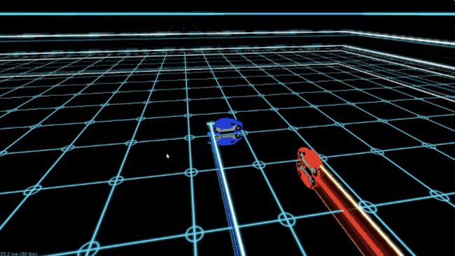

# Welcome to TRONado

##### A brief introduction: The History of Tron

Tron is a popular arcade game that is still played by many today. While Tron may seem like a purely skill based game, don't be fooled! The game consists of four players piloting a vehicle. The goal is to stay alive the longest, by not crashing into the walls or other player's trails. The longer a player survives, the longer their motorcycle trail increases. This creates an interesting dynamic because the amount of available moves quickly diminishes. Players have to think quick in order to avoid crashing into their own trail or other players' trails. Good players are quick to navigate and avoid collisions; however, great players come up with strategies to minimize the amount of moves available for other players or simply remain dormant--avoiding their ultimate demise!

##### What is TRONado?

TRONado is a newly rising agent that is set to destroy all opponenets who come in the way. The agent will be one of many participating in the Colosseum Reinforcement Learning Competition. In the midst of avoiding all obstacles (walls and other players), TRONado will learn strategies for beating its opponents. Such strategies may include sectioning off regions of the board, or playing passively.

##### The Current Agent

The agent can be trained through reinforcement learning algorithms such as A3C, TD3, DQN, Policy Gradients, or PPO. The agent will learn to play against a SimpleAvoidAgent() that will continue to go straight until there is an obstacle in front of it. When the SimpleAvoidAgent() detects the obstacle, it will move to the left or right to avoid the obstacle if possible. Our agent will begin its training against the SimpleAvoidAgent. Early on, our agent will lose quite often, but as it plays more games, our agent will learn and get better. Our agent will take in an observation (the whole board) and output the “best” action.

Important Links:

- [Proposal](proposal.html)
- [Status](status.html)
- [Final](final.html)
