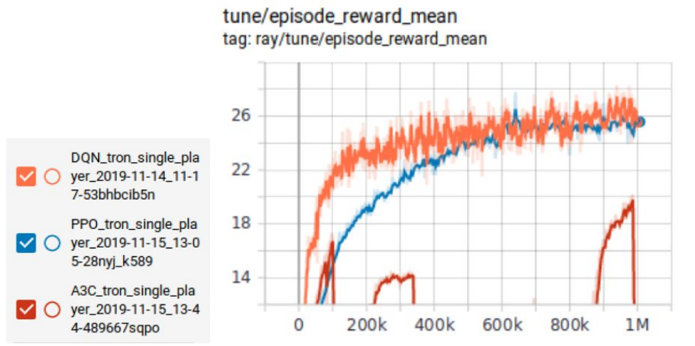
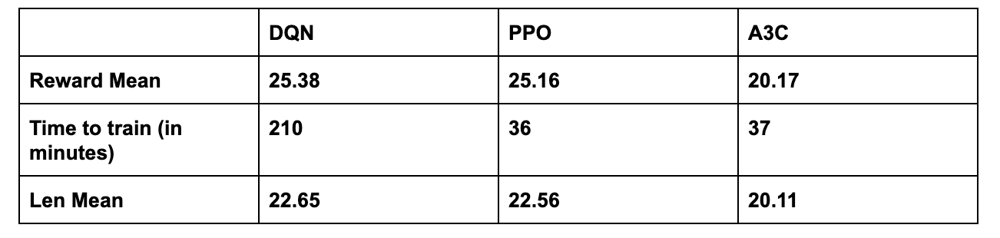
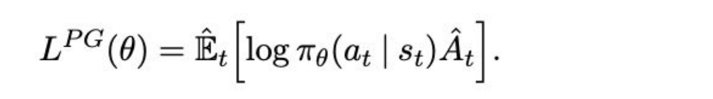
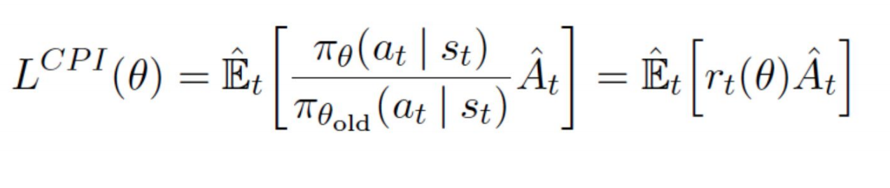
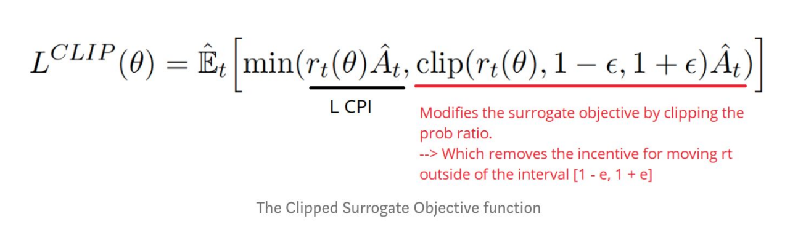
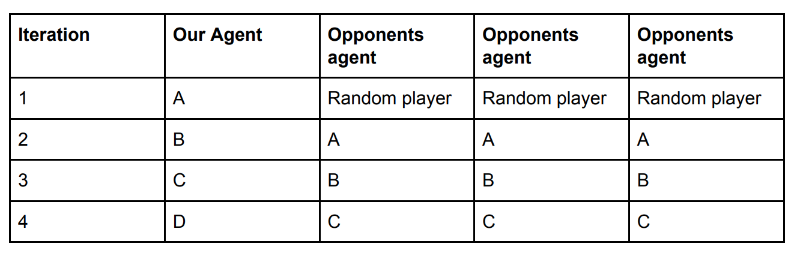
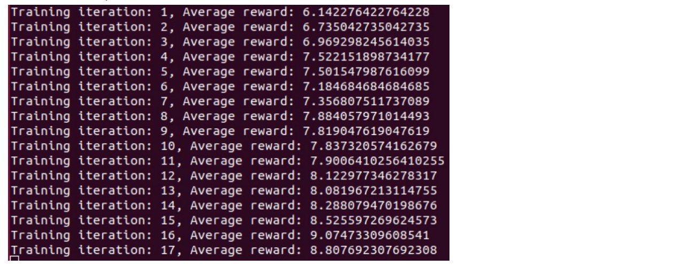
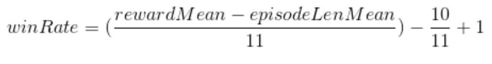
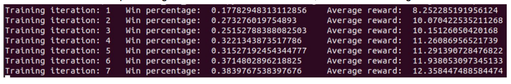
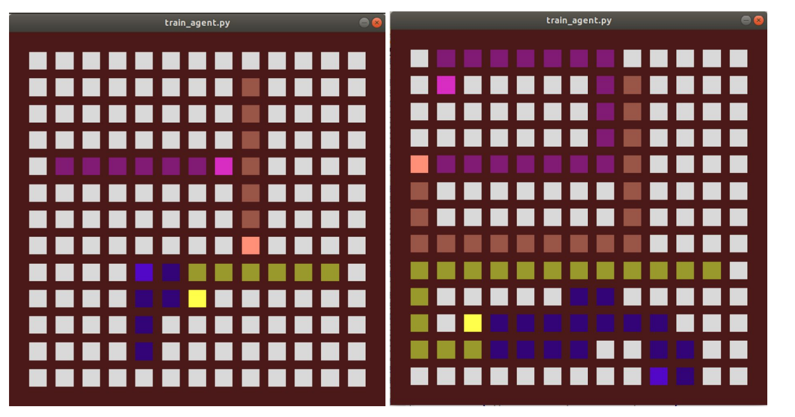

# Status Report

### Project Summary:

##### Checkout the status report video by clicking the image below!

##### Colosseum RL Competition:
Tron is a fully-observable multiagent free-for-all turn-based game. The goal of the competition is to
develop an agent that survives the longest. The agent must avoid walls and its opponents, but also learn
strategies such as sectioning off a large chunk of the 25x25 board so that there is less room for its
opponents to move.

##### The Agent:
The agent can be trained through reinforcement learning algorithms such as A3C, TD3, DQN, Policy
Gradients, or PPO. The agent will learn to play against a SimpleAvoidAgent() that will continue to go
straight until there is an obstacle in front of it. When the SimpleAvoidAgent() detects the obstacle, it will
move to the left or right to avoid the obstacle if possible. Our agent will begin its training against the
SimpleAvoidAgent. Early on, our agent will lose quite often, but as it plays more games, our agent will
learn and get better. Our agent will take in an observation (the whole board) and output the “best”
action.

## Approach:
##### Choosing RL Algorithm:
Since each agent can only be trained by one algorithm and our goal is to create the best agent, we will
run each algorithm for 1 million iterations and see which algorithm produces the best agent. From there
we will adjust various hyperparameters in attempts to create a better agent than the default algorithm
produces.

Based off of these results, we chose to use PPO as our main algorithm because it did as well as DQN
after 1 million iterations and it trained in 1/6th the time.

##### Proximal Policy Optimization:
PPO improves the stability of the Actor training by limiting the policy update at each training
step.
The policy gradient or the loss function in the PPO is given by LPG(theta), PiTheta(at|st) is the
log of the probability of an action at a particular state, At compares if the particular action with
other possible actions at that state, if At>0 then the action is better than the other possible
actions.

But instead of log function, we can take the ratio of the action under current policy to the
probable action under the previous policy. Then the equation changes to the below equation.

In the above equation, if the rt(theta) is more than 1, the current action is more probable and if
the rt(theta) is between 0-1, then the action is less probable in the current policy than the old.
However in this case when ratio is large, the policy update is extremely large as well which is
problematic.

Therefore in PPO, to avoid extreme policy update the ratio at are too much away from 1 are
clipped by changing the equation in the following manner. This method is called Clipped
Surrogate Objective function.

We used hyperparameter epsilon value of 0.2 from original Schulman et al paper. Thus ratio
can only vary from 0.8 to 1.2.

##### Training agent through self-play:

After deciding on PPO as our choice of algorithm, we plan to further train our agent through self play in
the following manner (Table 1):

In the first iteration, we train our agent against three random agents. After our agent learns to outwit its
opponents and achieve a win rate of 75%, we will update the opponents to have the same weights as our
agent, making the opponents as good as our agent. At this point, the win rate will drop and our agent will
have to learn how to beat itself. Once our agent’s win rate increases pass a certain threshold, we will
replace the opponents with a copy of our agent. We will repeat this process until we have created the
“best” possible agent. There is a possibility that our “best” agent is not the best because the agent can get
stuck at a local min/max. To avoid this problem, we will train multiple agents and have them play each
other to determine the best agent.

### Evaluation:
##### Reward Evaluation Method:
One way to evaluate our model is to look at the reward the agent gets over time. Every move that the
agent makes that leads to the agent staying alive another step gives the agent a +1 reward. If the agent
wins the game, it gets a +10 reward. If the agent loses, it gets a -1 reward. By looking at the reward
increase over time, we can conclude that the agent is learning and surviving longer. After a certain point,
the reward will plateau.

##### Win-Rate Evaluation Method:
The second way of evaluating our model is to look at the win-rate. The win-rate tells us how often our
agent is beating the other agents. Win-rate is calculated with the equation below where rewardMean is
the average reward for the current policy and episodeLenMean is the average length of each of the
games.

We can see that the win percentage increases after each iteration, as does the average reward.

##### Visual Evaluation Method:
The third and least quantitative way of evaluation is to watch a game that uses the current policy. The
image on the left is an agent using the PPO algorithm during the 5th iteration. The image on the right is
the same agent after 20 iterations. We can see that the agent is no longer running into itself or the wall as
often. It is also learning to make more complex moves in attempts to get a higher reward.

### Remaining Goals and Challenges:
##### Remaining Goals
Our first and most important goal is to write code that allows us to connect our agent to the competition
server. Once that is done, we can focus on the main goal of the competition, which is to create the
longest surviving agent we can. To do this, we will create multiple agents trained through self-play and
determine which one is best by having our trained agents play against each other for multiple games. We
will also try various techniques such as increasing/decreasing the win rate threshold before we update our
opponents. To prevent our agent from overfitting to its opponents, we will train our agent on previous
iterations of itself and other agents.

##### Challenges
One challenge we face is the amount of time it takes to train a model using self play, we are having a bit
of trouble getting our program to use GPU acceleration so everything has been using CPU and it is really
slow.

**Update** After talking to our mentors for this project, we learned that GPU acceleration is not going to
help much because the bottleneck of our training is gathering samples which requires running multiple
CPUs in parallel.

##### Resources:
1. Tron environment setup from UCI RL Colosseum
2. Ray Library for algorithm implementation
3. Stephen McAleer and Alexander Shmakov

